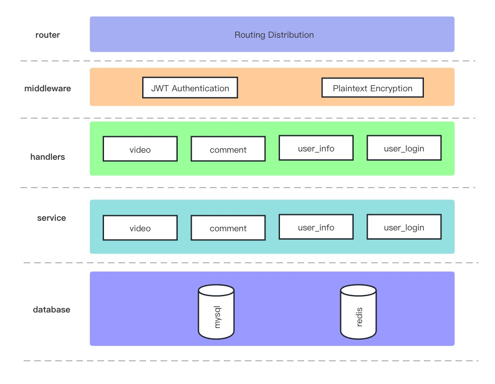

# Tiktok

## 文件目录结构

```
·
├── cache          # Redis数据访问（缓存）
├── config         # 配置信息结构
├── handlers       # 处理器
│   ├── comment    # 评论处理
│   ├── user_info  # 用户信息处理
│   ├── user_login # 用户登录处理
│   └── video      # 视频处理
├── log            # 日志目录
├── logger         # 日志记录
├── middleware     # 中间件
├── models         # 模型
├── router         # 路由
├── service        # 服务
│   ├── comment    # 评论服务
│   ├── user_info  # 用户信息服务
│   ├── user_login # 用户登录服务
│   └── video      # 视频服务
└── utils          # 工具

```

## **技术栈**

- JWT：负责生成和验证 token，用于身份验证和授权。
- Gorm：利用 Gorm 进行 MySQL 的 ORM 操作，实现数据持久化和管理。
- Go-Redis：利用 Go-Redis 对频繁访问的数据进行缓存，提高系统性能和响应速度。
- Viper：使用 Viper 解析和读取配置文件，实现配置管理与灵活性。
- Zap 和 Lumberjack：结合 Zap 进行日志记录与打印，利用 Lumberjack 进行日志分割和管理，确保日志记录的可靠性和可管理性。

## 架构图



用户发送请求到路由（router），路由根据请求的URL和HTTP方法将请求转发给对应的处理器（handlers）。处理器接收到请求后，需要进行一些预处理工作，比如验证用户身份、检查请求参数等，需要依赖中间件（middleware）来完成。处理器根据请求的内容调用相应的服务（service）。服务层负责处理具体的业务逻辑，从数据库中获取数据、对数据进行处理等。服务层处理完业务逻辑后，将结果返回给处理器。最后处理器返回的结果发送给用户，完成请求-响应周期。

## **数据库关系说明**


## 可改进的地方

1. **测试**：编写充分的单元测试和集成测试，以确保代码的质量和稳定性。测试应该覆盖代码的所有关键路径和边界情况。
2. **持续集成和部署**：建立自动化的持续集成和部署流水线，以便在代码发生变更时自动进行构建、测试和部署。这有助于提高开发效率和代码质量。
3. **容器化和编排**：将应用程序容器化，使用容器编排工具（如Docker和Kubernetes）来管理和部署容器。这样可以实现更高效的资源利用和自动化运维，提高系统的可靠性和可扩展性。
4. **对象存储：**使用对象存储来进行视频的存储。